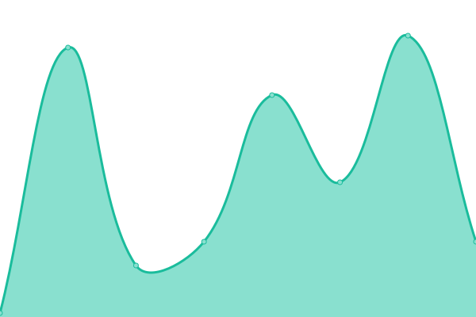
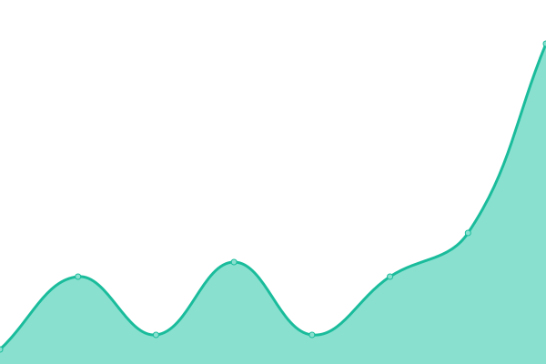
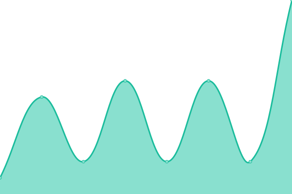
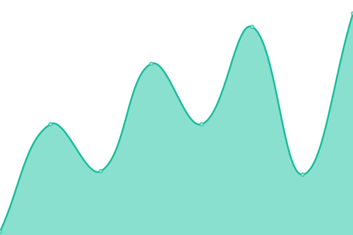
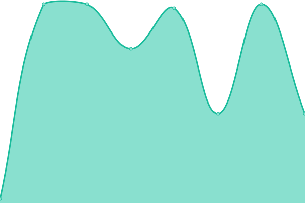
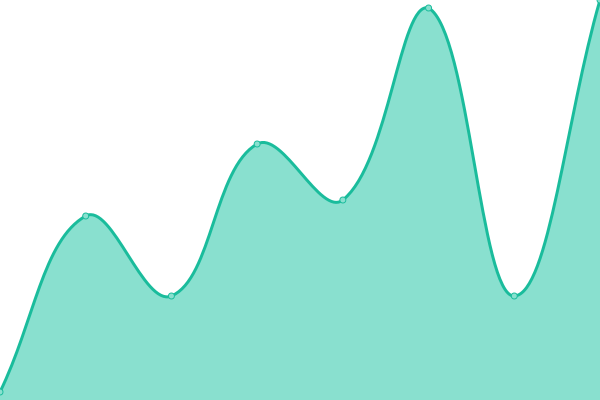

# [📈 Live Status](https://northpolesec.github.io/status): <!--live status--> **🟩 All systems operational**

This repository contains the open-source uptime monitor and status page for [North Pole Security](https://northpolesec.com), powered by [Upptime](https://github.com/upptime/upptime).

With [Upptime](https://upptime.js.org), you can get your own unlimited and free uptime monitor and status page, powered entirely by a GitHub repository. We use [Issues](https://github.com/northpolesec/status/issues) as incident reports, [Actions](https://github.com/northpolesec/status/actions) as uptime monitors, and [Pages](https://northpolesec.github.io/status) for the status page.

<!--start: status pages-->
<!-- This summary is generated by Upptime (https://github.com/upptime/upptime) -->
<!-- Do not edit this manually, your changes will be overwritten -->
<!-- prettier-ignore -->
| URL | Status | History | Response Time | Uptime |
| --- | ------ | ------- | ------------- | ------ |
|  [APNSProxy (AWS)](apnsproxy-aws.workshop.cloud) | 🟩 Up | [apns-proxy-aws.yml](https://github.com/northpolesec/status/commits/HEAD/history/apns-proxy-aws.yml) | 

 31ms
     
 | 

<a href="https://status.northpole.security/history/apns-proxy-aws">100.00%</a>
    

|  [APNSProxy (GCP)](apnsproxy-gcp.workshop.cloud) | 🟩 Up | [apns-proxy-gcp.yml](https://github.com/northpolesec/status/commits/HEAD/history/apns-proxy-gcp.yml) | 

 11ms
     
 | 

<a href="https://status.northpole.security/history/apns-proxy-gcp">100.00%</a>
    

|  [Coalmine](coalmine.northpole.security) | 🟩 Up | [coalmine.yml](https://github.com/northpolesec/status/commits/HEAD/history/coalmine.yml) | 

 6ms
     
 | 

<a href="https://status.northpole.security/history/coalmine">100.00%</a>
    

|  [Push Service Staging (east)](east1.staging.push.northpole.security) | 🟩 Up | [push-service-staging-east.yml](https://github.com/northpolesec/status/commits/HEAD/history/push-service-staging-east.yml) | 

 40ms
     
 | 

<a href="https://status.northpole.security/history/push-service-staging-east">97.57%</a>
    

|  [Push Service Staging (west)](west1.staging.push.northpole.security) | 🟩 Up | [push-service-staging-west.yml](https://github.com/northpolesec/status/commits/HEAD/history/push-service-staging-west.yml) | 

 62ms
     
 | 

<a href="https://status.northpole.security/history/push-service-staging-west">97.57%</a>
    

|  [Push Service Staging (central)](central1.staging.push.northpole.security) | 🟩 Up | [push-service-staging-central.yml](https://github.com/northpolesec/status/commits/HEAD/history/push-service-staging-central.yml) | 

 38ms
     
 | 

<a href="https://status.northpole.security/history/push-service-staging-central">97.57%</a>
    

<!--end: status pages-->

[**Visit our status website →**](https://northpolesec.github.io/status)

## 📄 License

- Powered by: [Upptime](https://github.com/upptime/upptime)
- Code: [MIT](./LICENSE) © [Anand Chowdhary](https://anandchowdhary.com), supported by [Pabio](https://pabio.com)
- Data in the `./history` directory: [Open Database License](https://opendatacommons.org/licenses/odbl/1-0/)
