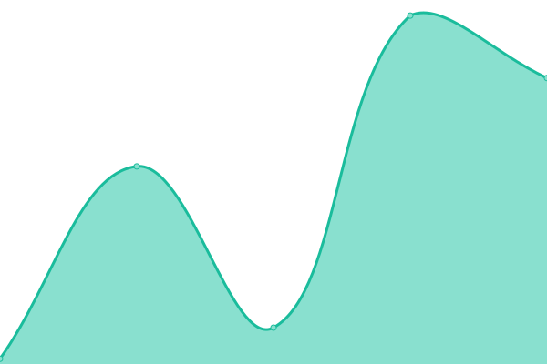
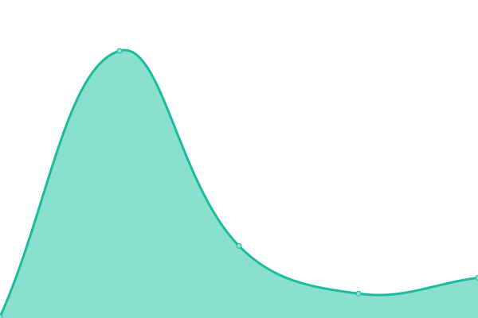

# [📈 Live Status](https://northpolesec.github.io/status): <!--live status--> **🟩 All systems operational**

This repository contains the open-source uptime monitor and status page for [North Pole Security](https://northpolesec.com), powered by [Upptime](https://github.com/upptime/upptime).

With [Upptime](https://upptime.js.org), you can get your own unlimited and free uptime monitor and status page, powered entirely by a GitHub repository. We use [Issues](https://github.com/northpolesec/status/issues) as incident reports, [Actions](https://github.com/northpolesec/status/actions) as uptime monitors, and [Pages](https://northpolesec.github.io/status) for the status page.

<!--start: status pages-->
<!-- This summary is generated by Upptime (https://github.com/upptime/upptime) -->
<!-- Do not edit this manually, your changes will be overwritten -->
<!-- prettier-ignore -->
| URL | Status | History | Response Time | Uptime |
| --- | ------ | ------- | ------------- | ------ |
|  [Billing Server](coalmine.northpole.security) | 🟩 Up | [billing-server.yml](https://github.com/northpolesec/status/commits/HEAD/history/billing-server.yml) | 

 7ms
     
 | 

<a href="https://status.northpole.security/history/billing-server">100.00%</a>
    

|  [Push Service Staging (east)](east1.staging.push.northpole.security) | 🟩 Up | [push-service-staging-east.yml](https://github.com/northpolesec/status/commits/HEAD/history/push-service-staging-east.yml) | 

 32ms
     
 | 

<a href="https://status.northpole.security/history/push-service-staging-east">100.00%</a>
    

|  [Push Service Staging (west)](west1.staging.push.northpole.security) | 🟩 Up | [push-service-staging-west.yml](https://github.com/northpolesec/status/commits/HEAD/history/push-service-staging-west.yml) | 

 51ms
     
 | 

<a href="https://status.northpole.security/history/push-service-staging-west">100.00%</a>
    

|  [Push Service Staging (central)](central1.staging.push.northpole.security) | 🟩 Up | [push-service-staging-central.yml](https://github.com/northpolesec/status/commits/HEAD/history/push-service-staging-central.yml) | 

 36ms
     
 | 

<a href="https://status.northpole.security/history/push-service-staging-central">100.00%</a>
    

|  [Global Allowlist & Package Rules](gal.northpole.security) | 🟩 Up | [global-allowlist-and-package-rules.yml](https://github.com/northpolesec/status/commits/HEAD/history/global-allowlist-and-package-rules.yml) | 

 7ms
     
 | 

<a href="https://status.northpole.security/history/global-allowlist-and-package-rules">100.00%</a>
    

<!--end: status pages-->

[**Visit our status website →**](https://northpolesec.github.io/status)

## 📄 License

- Powered by: [Upptime](https://github.com/upptime/upptime)
- Code: [MIT](./LICENSE) © [Anand Chowdhary](https://anandchowdhary.com), supported by [Pabio](https://pabio.com)
- Data in the `./history` directory: [Open Database License](https://opendatacommons.org/licenses/odbl/1-0/)
